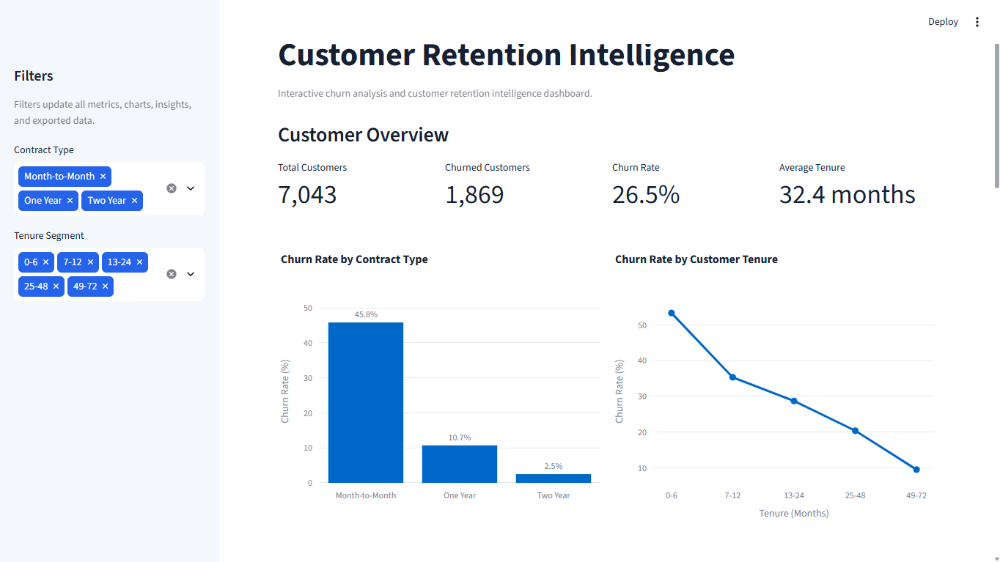
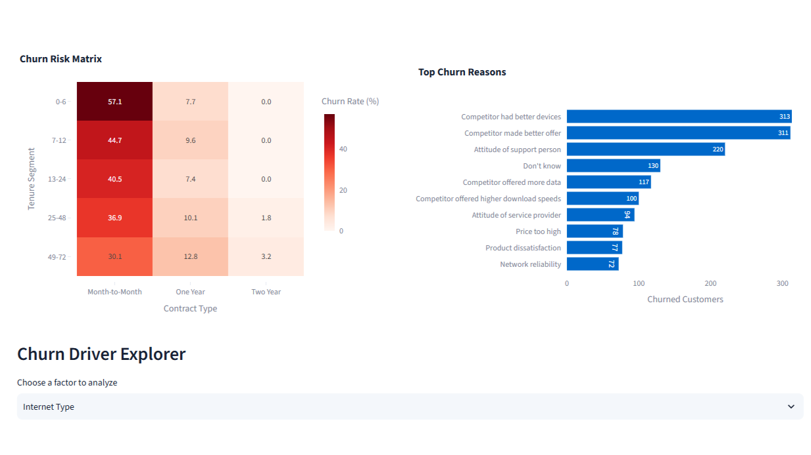
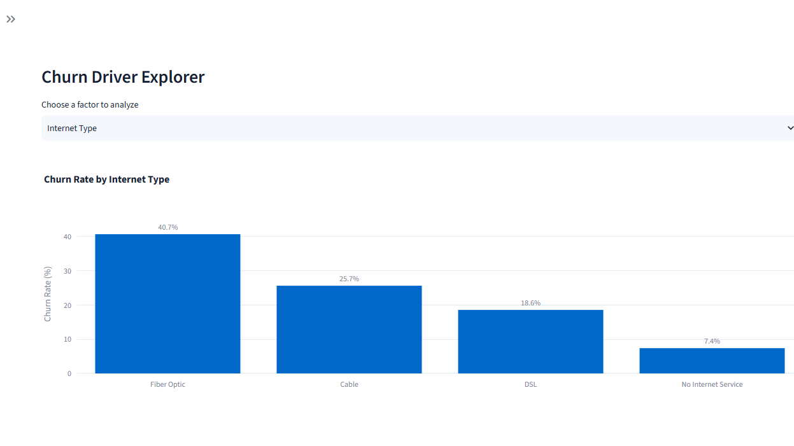
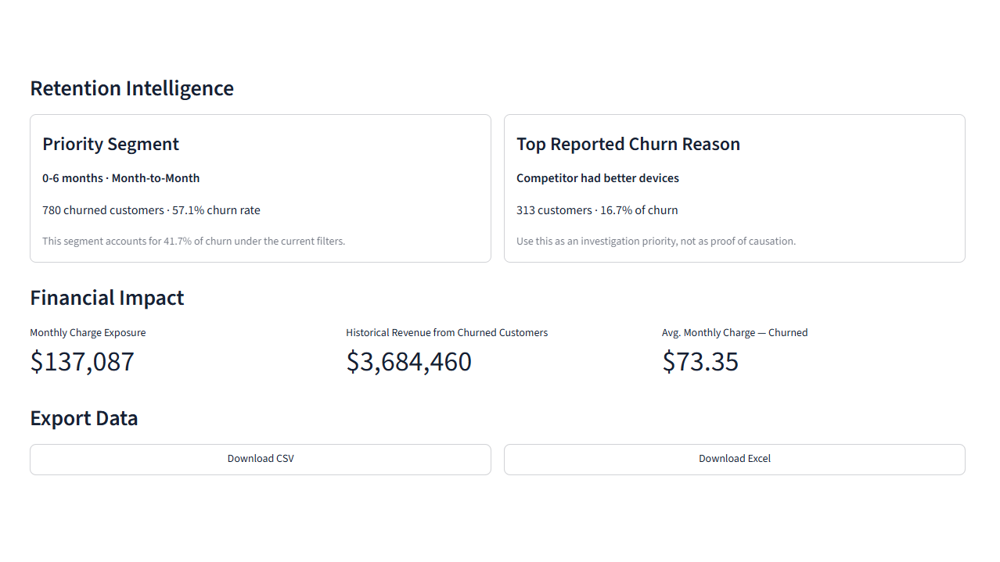

# Customer Retention Intelligence

An interactive customer churn and retention analytics application built with Python, Pandas, Streamlit, and Plotly.

The application transforms telecom customer data into actionable retention intelligence by identifying high-impact customer segments, analyzing churn patterns and reported reasons, exploring potential churn drivers, and quantifying financial exposure.

## Dashboard Overview



## Key Features

- Interactive filtering by contract type and customer tenure
- Dynamic customer, churn, and tenure KPIs
- Contract and tenure-based churn analysis
- Contract × tenure churn risk matrix
- Top reported churn reason analysis
- Interactive churn driver explorer
- Priority customer segment identification
- Financial impact indicators
- CSV and Excel export of filtered customer data
- Empty-state and edge-case handling
- Cached data loading and export generation

## Key Insights

Analysis of 7,043 telecom customers showed:

- Overall churn rate: **26.5%**
- Customers in the **0–6 month + Month-to-Month** segment had a **57.1% churn rate**
- This segment accounted for **780 churned customers**, making it the highest-impact retention segment
- **Competitor had better devices** was the most frequently reported churn reason
- Fiber Optic customers showed a substantially higher observed churn rate than other internet types
- Contract type and customer tenure showed strong associations with churn

These findings represent descriptive associations and reported churn reasons, not proof of causal relationships.

## Churn Risk Analysis

The dashboard combines tenure and contract type to reveal high-churn customer segments while also showing the most frequently reported reasons for leaving.



## Churn Driver Explorer

Users can dynamically explore churn rates across factors including internet type, premium tech support, online security, payment method, and customer offers.



## Retention Intelligence

The application converts analytical results into decision-oriented summaries, highlighting the highest-impact customer segment, top reported churn reason, financial indicators, and exportable filtered data.



## Architecture

The project separates data preparation, analytics, visualization, exporting, and user interface responsibilities.

```text
customer-retention-intelligence/
├── app.py
├── analytics.py
├── data_processing.py
├── visualizations.py
├── export_utils.py
├── requirements.txt
├── .streamlit/
│   └── config.toml
├── data/
│   └── telecom_customer_churn.csv
└── assets/
```

### Module Responsibilities

| Module | Responsibility |
|---|---|
| `data_processing.py` | Data loading, semantic missing-value handling, and feature preparation |
| `analytics.py` | Churn metrics, segmentation, risk matrix, driver analysis, and financial calculations |
| `visualizations.py` | Reusable Plotly visualization functions |
| `export_utils.py` | In-memory CSV and Excel generation |
| `app.py` | Streamlit interface, filtering, KPIs, layout, and user interaction |

## Data Quality Approach

Missing values were evaluated based on their business meaning rather than blindly removed or imputed.

For example:

- Missing internet attributes correspond to customers without internet service
- Missing phone-related attributes correspond to customers without phone service
- Churn reasons are unavailable for customers who did not churn
- Missing offer values are represented as `No Offer`

This preserves the semantic meaning of the original data during analysis.

## Tech Stack

- Python
- Pandas
- Streamlit
- Plotly
- OpenPyXL

## Run Locally

Clone the repository:

```bash
git clone https://github.com/niisa0/customer-retention-intelligence.git
cd customer-retention-intelligence
```

Create a virtual environment and install the dependencies:

```bash
python -m venv .venv
pip install -r requirements.txt
```

Run the application:

```bash
streamlit run app.py
```

## Dataset

This project uses the **Maven Analytics Telecom Customer Churn** dataset, containing information about 7,043 customers of a fictional telecommunications company in California.

Dataset information: [Maven Churn Challenge](https://mavenanalytics.io/blog/maven-churn-challenge)

## Notes

The dashboard provides descriptive retention analytics and decision-support insights. Observed relationships should not be interpreted as causal effects or predictive guarantees.